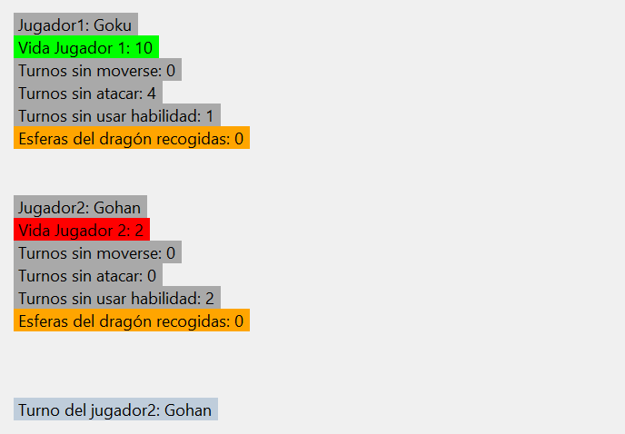
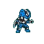
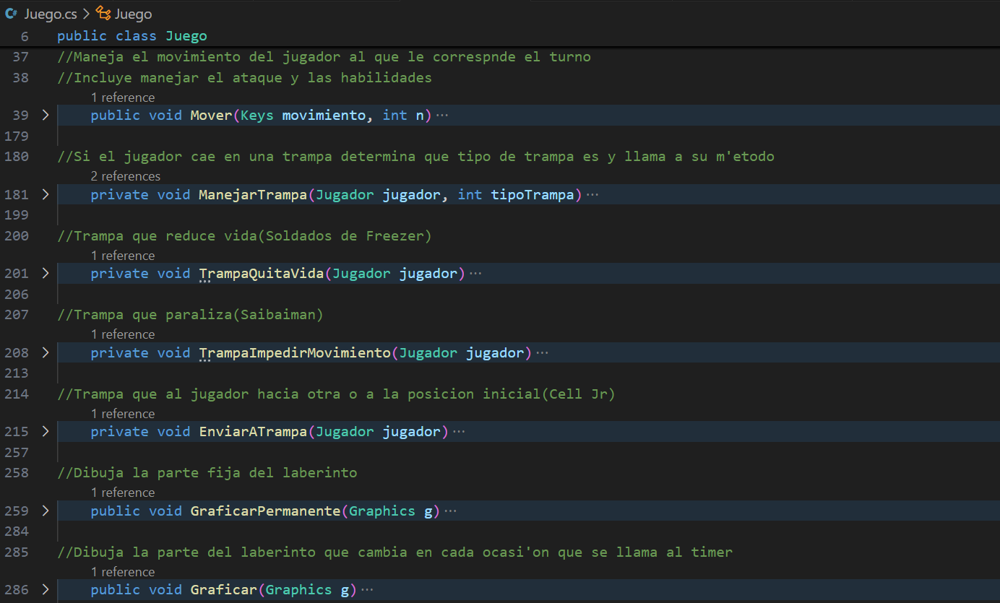

Proyecto de Programación I. Mazerunners

Ignacio Miguel Rodríguez Pacheco C121

Mazerunners es un juego multijugador con temática de escape de un laberinto, desarrollado utilizando Windows Form. El objetivo del juego es recoger todas las esferas del dragón para que aparezca la salida del laberinto, y el jugador con mayor cantidad de esferas del dragón que llegue a la salida gana.

Instrucciones para jugar:
1.	Ejecutar el proyecto utilizando el comando dotnet run en una terminal desde la carpeta del proyecto.
2.	Hacer click en el botón "Jugar" para iniciar una partida.
3.	Seleccionar los personajes para jugar.
4.	Utilizar las teclas W (hacia arriba), S (hacia abajo), A (izquierda) y D (derecha) para moverse.
5.	Utilizar la tecla P para atacar y la tecla O para usar una habilidad.
6.	Si un jugador introduce otra tecla distinta a las mencionadas, realiza un movimiento no válido, ataca o usa su habilidad cuando los turnos sin atacar o el tiempo de enfriamiento son mayores que cero pierde su turno.
7.	Si un jugador está paralizado (turnos sin moverse>0) se salta su turno.

Personajes y habilidades: 
•	Goku: Genkidama (4 de daño al oponente)
•	Gohan: Potencial Desatado (4 de daño al oponente)
•	Vegeta: Garlick Canon (3 de daño al oponente y parálisis)
•	Freezer: Habilidad similar a Vegeta con mayor tiempo de parálisis y menor daño sobre el oponente
•	Piccollo: Regeneración (aumenta su vida)
•	Cell: Absorción (reduce la vida del oponente y aumenta la suya)
•	Krillin: Parálisis (impide el movimiento de los oponentes)
•	Androide 18: Explosión (disminuye la vida del oponente y la suya propia)
•	Trunks: Duplica su velocidad cada vez que se activa la habilidad
•	Majin Buu: Aumenta su vida a 30 y aumenta en 2 su fuerza de ataque cada vez que se activa la habilidad

Al ser mucho más poderosas sus habilidades Trunks y Majin Boo cuentan con un tiempo de enfriamiento mucho mayor que el de los demás personajes (150 turnos).
Una vez seleccionados los personajes se presiona el botón confirmar e inicia el juego. Al costado del laberinto hay varias etiquetas label para visualizar el estado de los jugadores:
 

El objetivo del juego es recoger todas las esferas del dragón para que aparezca la salida del laberinto, una vez esta aparezca el jugador con mayor cantidad de esferas del dragón que llegue a la salida gana y el juego se detiene mostrando un mensaje con el ganador, si el jugador que llega no es el que más esferas del dragón tiene este volverá a su posición inicial, la salida del laberinto desaparece si luego de ser recogidas todas las esferas del dragón un jugador muere al caer en una trampa, ese jugador perderá una esfera del dragón  que será generada en el mapa y deberá ser recogida para que aparezca la salida nuevamente.
              

Existen tres tipos de trampa:
Los Saibaiman te impiden moverte por dos turnos

Los soldados de freezer te quitan dos de vida

 

Cell Jr te transporta hacia alguna de las dos trampas anteriores, en caso de que no quedar trampas de los otros dos tipos te transporta a la posición inicial

Un jugador puede quitarle una esfera del dragón a otro si reduce su vida a cero, para lograr esto puede emplear su habilidad (si esta reduce vida) o puede atacarlo, para atacar a otro jugador este tiene que encontrar en una celda aledaña (arriba, izquierda, abajo, derecha)

Sobre el código, clases utilizadas con los métodos más importantes:
Celda: solo contiene un constructor donde se inicializan propiedades como el Valor de la celda (todas son cero por defecto, que representan un muro…arreglar…), si es trampa o es una posición clave (puntos de inicio y salida)

Menú: menú inicial, es un formulario con botones que permiten ejecutar las siguientes acciones, jugar, ver las instrucciones, ver las habilidades y salir

Laberinto: encargada de generar el laberinto (una matriz de celdas), contiene varios métodos:
 

Jugador:

 
Juego:
 

Form1: en este formulario se muestra el juego y se llaman a los métodos de la clase juego

 
SeleccionPersonajes:
 
